# Building desktop app (.exe) with JavaFX 
## Introduction
In this guide, you will learn how to build an executable **JavaFX** desktop application and later can run it without IDE by just clicking *.exe* file.  
The problem with JavaFX is that Oracle is ruining this awesome tool by making it harder to execute on JDK 11, but referencing this [link](https://stackoverflow.com/questions/61555515/intellij-idea-javafx-export-cant-build-artifact-fxdeploy-is-not-available) I have just chosen to download JDK 8 since it is building JavaFX without any issues.
## Install JDK 8
To do that go [there](https://docs.aws.amazon.com/corretto/latest/corretto-8-ug/downloads-list.html) and download a particular version for your OS
## Install SceneBuilder for building GUI for our app  
Go to the [site](https://gluonhq.com/products/scene-builder/) and download the app.
## Download JavaFX  
Go to the [site](https://gluonhq.com/products/javafx/) and download JavaFX Windows SDK.
Then you unzip in your chosen directory. You will source this for each JavaFX project. (Unfortunately each time the same steps).

## Run your first JavaFX app via IntelliJ  
1.  Click **[+ New Project]** -> **[Java FX]** -> **[Project SDK]** -> **[Corretto-11 java version “11.0.8”]** -> **[Next]** -> **[Name and propject location]** -> **[Finish]**  
2.  Go to **[File]** -> **[Project Structure…]** *or Ctr+Alt+Shift+S* -> **[Libraries]** -> **[New Project Library (+) sign]** -> **[Java]** -> **[Choose the directory of unzipped SDK folder lib]** -> **[Press okay]**  
3.  Go to **[Run]** -> In Application/Main in *Configuration* tab under field **[VM Options:]** you have to place the following fields:
```shell
--module-path \javafx-sdk-11.0.2\lib --add-modules javafx.controls,javafx.fxml
```
Instead of *\javafx-sdk-11.0.2\lib* you need to set your own directory of JavaFX lib folder.

4.  Run (shift + f10) Main.java and you will see this window if you do all these steps correctly.   
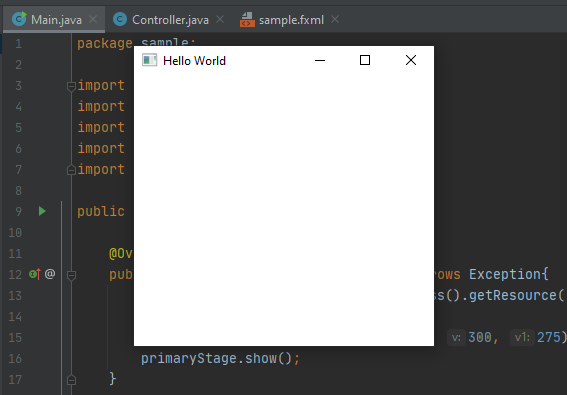

## Build a JavaFX app with SceneBuilder
For the sake of simplicity, I will build a simple currency converter app which will use API.   
 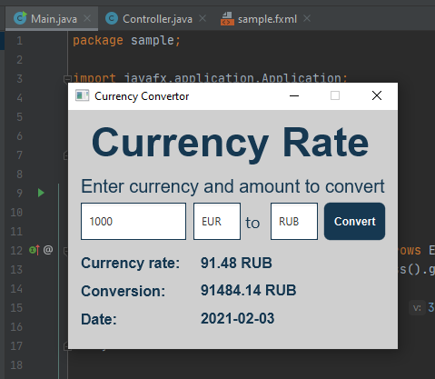
1.	Open SceneBuilder
2.	Choose **Open Project**
3.	Find in a directory of the app (in src folder) **.fxml** file and open it
4.	For the moment we will drop default GridPane (0x0)    
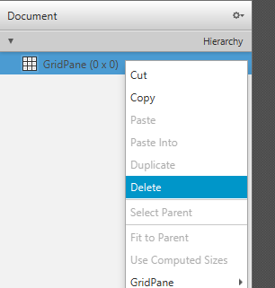
5.	Drag AnchorPane and move to the main screen. This is the main window of our application.    
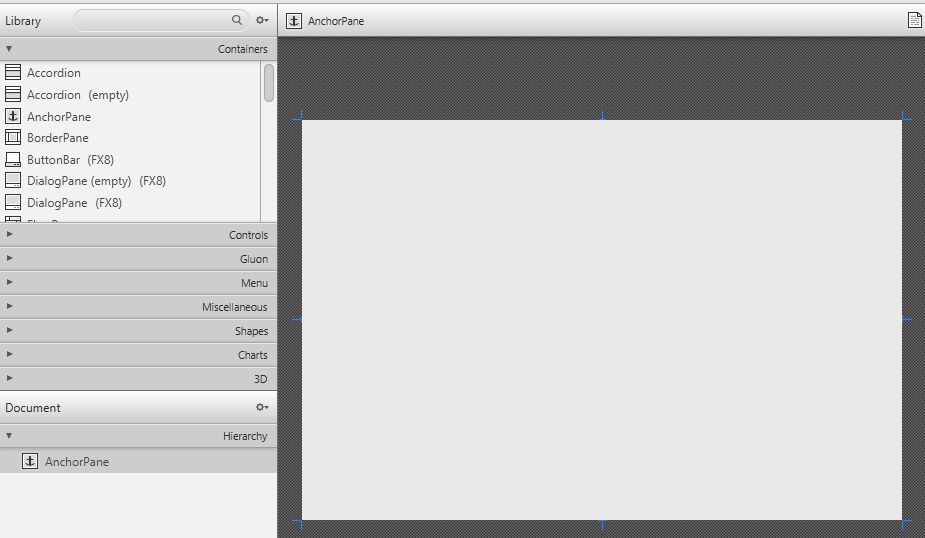
6.	We can adjust the size of the window as well as colour and style if you are familiar with *CSS*
7.	We can use the search window to quickly find an object, for example, “Text”. Drag to the main screen and adjust the size of Text area and styling.  
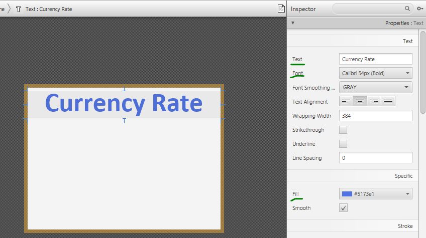
8.	Then keep filling like you wish the App. And at the end, the layout should look similar to this:  
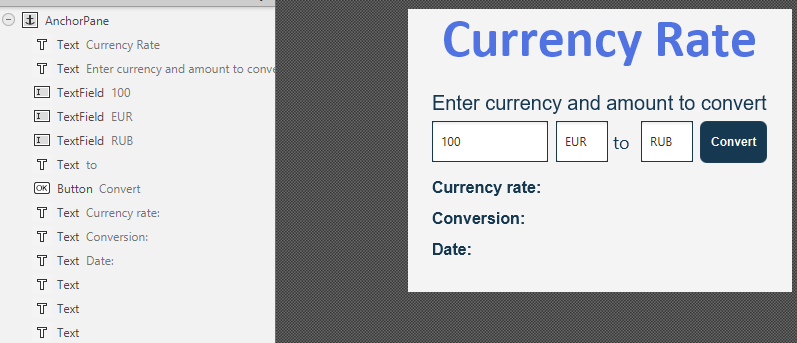  

You now can preview the app, go to **[Preview]** -> **[Show Preview in Window]** or simply *Ctrl+P*
Now steps to use this template in our app as well as set-up IDs for further uses.
1.	To further use an object in code and provide the reactivity for that we need to set **fx:id**. Select the object and on the right side of the SceneBuilder click tab **[Code]**. You will see the **fx:id** fill the id of the object. Place IDs for other objects.  
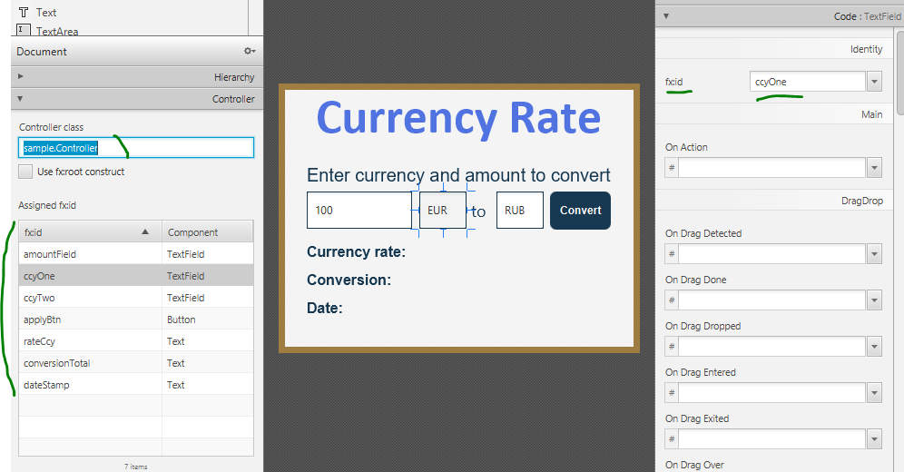
2.	I built three empty text objects and assign **fx:id** for them to display the information about currency rate; conversion and date when button “Convert” is clicked.  
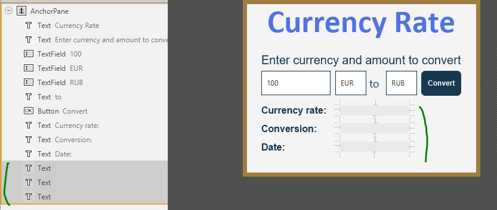
3.	After previous steps, we save the changes (Ctrl + S) it will replace **.fxml** layout to our built layout in SceneBuilder.
4.	In button left side click **[Controller]** and in field **[Contoller class]** and provide the root to Controller.java. For example **[sample.Controller]**  

5.	Finally, we need to click **[View]** -> **[Show Sample Controller Skeleton]** -> click in right button **[Full]** then Copy and paste in the app directory *Controller.java*  
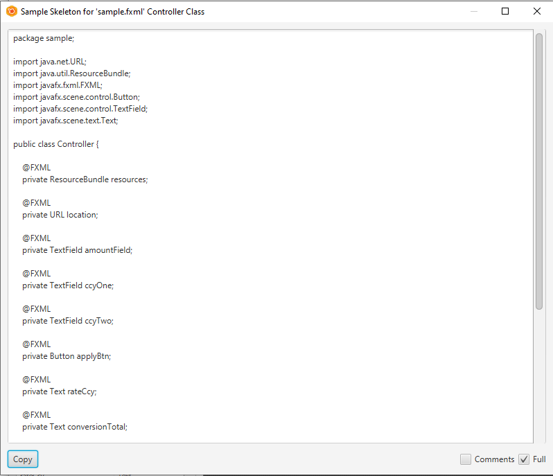
I got something like this:
```Java
package sample;

import java.net.URL;
import java.util.ResourceBundle;
import javafx.fxml.FXML;
import javafx.scene.control.Button;
import javafx.scene.control.TextField;
import javafx.scene.text.Text;

public class Controller {

    @FXML
    private ResourceBundle resources;

    @FXML
    private URL location;

    @FXML
    private TextField amountField;

    @FXML
    private TextField ccyOne;

    @FXML
    private TextField ccyTwo;

    @FXML
    private Button applyBtn;

    @FXML
    private Text rateCcy;

    @FXML
    private Text conversionTotal;

    @FXML
    private Text dateStamp;

    @FXML
    void initialize() {
        assert amountField != null : "fx:id=\"amountField\" was not injected: check your FXML file 'sample.fxml'.";
        assert ccyOne != null : "fx:id=\"ccyOne\" was not injected: check your FXML file 'sample.fxml'.";
        assert ccyTwo != null : "fx:id=\"ccyTwo\" was not injected: check your FXML file 'sample.fxml'.";
        assert applyBtn != null : "fx:id=\"applyBtn\" was not injected: check your FXML file 'sample.fxml'.";
        assert rateCcy != null : "fx:id=\"rateCcy\" was not injected: check your FXML file 'sample.fxml'.";
        assert conversionTotal != null : "fx:id=\"conversionTotal\" was not injected: check your FXML file 'sample.fxml'.";
        assert dateStamp != null : "fx:id=\"dateStamp\" was not injected: check your FXML file 'sample.fxml'.";

    }
}

```
## Coding application
Firstly, let's quickly fix **Main.java**:  
1. Set title: ``primaryStage.setTitle("Currency Converter");``
2. Place size from SceneBuilder in object **Scene**:
    `` primaryStage.setScene(new Scene(root, 384, 283));``
3. Fix the window to not be scaled:
    ``primaryStage.setResizable(false);``

Now we can go to Contoller.java and do all work there.  
There you could see the ``initialize()``. From this method we can drop warnings and rewrite the code to check is our template is functional or not. Let’s just add **sout** command to get output in the console by clicking the button:

```Java
@FXML
 void initialize() {
    applyBtn.setOnAction(event -> {
    System.out.println("IT WORKS!");
    });
 }
```  

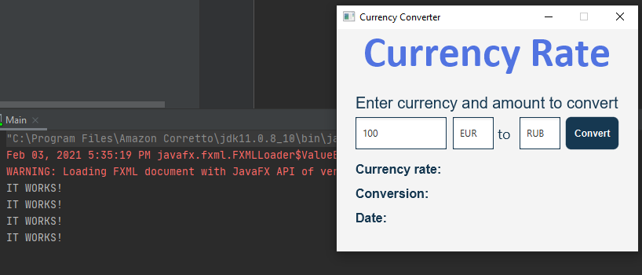

You might notice the red warning. This is because of compitability issues of JavaFX. Just go to **.fxml** file in **AnchorPane** and replace ``xmlns="http://javafx.com/javafx/15.0.1"`` to which version it asks (``xmlns="http://javafx.com/javafx/11.0.2"``)

## Install jar for JSON Parsing
Next let's install JSON jar from [here](https://mvnrepository.com/artifact/org.json/json/20201115) or [here](https://repo1.maven.org/maven2/org/json/json/20201115/json-20201115.jar). Store it in any directory and go to **[File]** -> **[Project Structure…]** *or Ctr+Alt+Shift+S* -> **[Libraries]** -> **[New Project Library (+) sign]** -> **[Java]** -> **[Choose jar file]** -> **[Press okay]** 

## Working with API
you actually can do any other API if you like. I choose first [link](https://currencylayer.com/) in google. I won't explain how to set-up - it is easy. But once you logged in go to how to start and find the api link with your assigned token like i did http://data.fixer.io/api/latest?access_key=27ad197ccf98251c14ebc0b13134de39&symbols=USD  
Even if you click this link it will open JSON object in your browser, so we can now use it in our application.

Before we need to build a class **getUrlContent** which will buffer data from the GET.

```Java
    private static String getUrlContent(String urlAddress) {
        StringBuffer content = new StringBuffer();
        try {
            URL url = new URL(urlAddress);
            URLConnection urlConn = url.openConnection();

            BufferedReader bufferedReader = new BufferedReader(new InputStreamReader(urlConn.getInputStream()));
            String line;
            while ((line = bufferedReader.readLine()) != null) {
                content.append(line + "\n");
            }
            bufferedReader.close();
        } catch (Exception e) {
            System.out.println("Error in conversion");
        }
        return content.toString();
    }
```

Now in the method **initialize()** we can build up our parser and output insted of sout function:

```Java
    @FXML
    void initialize() {
        applyBtn.setOnAction(event -> {
            String output = getUrlContent("http://data.fixer.io/api/latest?access_key=" +
                    "27ad197ccf98251c14ebc0b13134de39&symbols="+ccyOne.getText().toUpperCase()+","+ccyTwo.getText().toUpperCase());
            if(!output.isEmpty()) {
                JSONObject obj = new JSONObject(output);
                dateStamp.setText(obj.getString("date"));
                double ccyTwoValue = obj.getJSONObject("rates").getDouble(ccyTwo.getText()) /
                        obj.getJSONObject("rates").getDouble(ccyOne.getText());
                String ccyTwoStr = String.format("%.2f", ccyTwoValue) + " " + ccyTwo.getText();

                rateCcy.setText(ccyTwoStr);

                double amount = Double.parseDouble(amountField.getText());
                double total = ccyTwoValue * amount;
                String totalStr = String.format("%.2f", total) + " " + ccyTwo.getText();
                conversionTotal.setText(totalStr);
            }
        });
    }
```

And finally if it works then you can convert any currency and amount you would like. 

### !!! Be awere to use indexes for currncy like EUR - for euro or USD - for US Dollar.

## Build a self contained .exe file
If everything works then we can finally build our application as .exe file to use it without IDE.
1. Go to **[File]** -> **[Project Structure…]** *or Ctr+Alt+Shift+S* -> **[Project]** -> set Project as 1.8 and project language level as 8   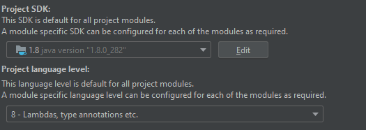
2. Go to **[Artifacts]** -> **+ Add** or Alt+Insert -> **JavaFX Application** -> **From module..**.
3. In output tab move JSON jar and lib from JavaFX to the left into .jar of your project  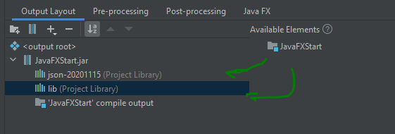
4. Go to tab **Java FX** in **Application class:** set your main class or click folder icon and choose, for example *sample.Main*, in **Native bundle:** choose all option and press ok.
5. Go to **[Build]** -> **[Build Artifacts..]**

If there is no errors it should create in **out.artifacts** folder bundle. Go there and you will the last folder where is .exe file. You can move this folder out of directory and it can works without IDE.  
 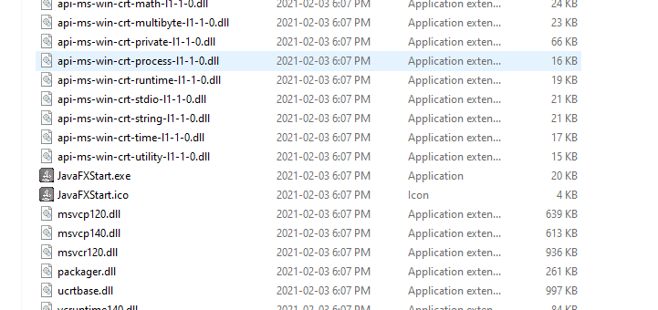  
 
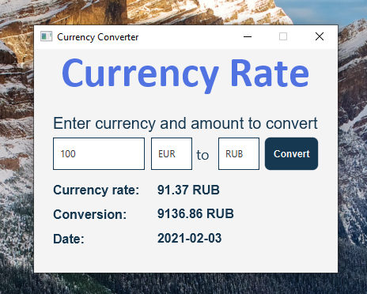
